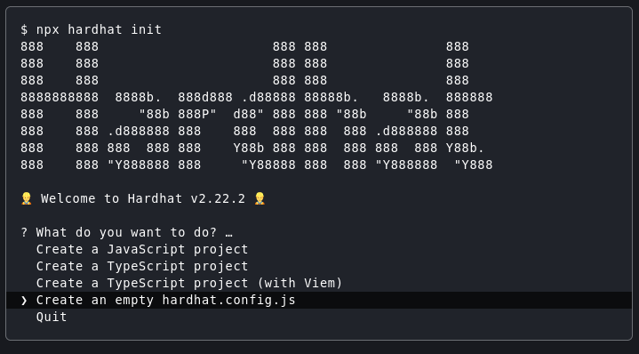
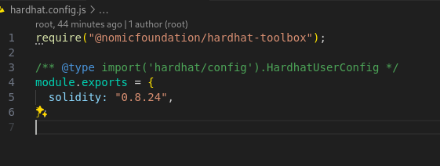
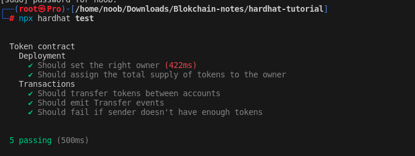

## Installation

## Pre-requirements

- `Node.js`
    ```bash
    # remove old versions
    $ sudo apt remove nodejs
    # install nodejs
    $ sudo apt install nodejs
    ```
- `npm`
    ```bash
    # remove old versions
    $ sudo apt remove npm
    # install npm
    $ sudo apt install npm
    ```

### Create a new project
    
- Create a new directory for your project
    ```bash
    $ mkdir my-project
    $ cd my-project
    ```
- Initialize a new npm project
    ```bash
    $ npm init -y
    ```
- Install Hardhat
    ```bash
    $ npm install --save-dev hardhat
    ```
- Initialize Hardhat
    ```bash
    $ npx hardhat
    ```
- Choose `Create an empty hardhat.config.js` and press enter

    

- Install Hardhat plugin for ethers.js
    ```bash
    $ npm install --save-dev @nomicfoundation/hardhat-toolbox
    ```
- Add following lines to `hardhat.config.js`
    ```javascript
    require("@nomicfoundation/hardhat-toolbox");
    ```
    - :

        

## Writing and compiling contracts


### Making contracts

- Create a new contract file in the `contracts/` directory
    ```bash
    $ touch contracts/Token.sol
    ```
- Write your contract in the file you created
    - [Sample contract](contracts/Token.sol)

### Compiling contracts

- Run the following command to compile your contracts
    ```bash
    $ npx hardhat compile
    Compiled 1 Solidity file successfully (evm target: paris).
    ```
    
## Testing contracts

### Writing tests

- Create a new test file in the `test/` directory
    ```bash
    $ touch test/Token.js
    ```
- Write your tests in the file you just created.
    - [Sample test](test/Token.js)

### Running tests

- Run the following command to run your tests
    ```bash
    $ npx hardhat test
    ```
    - which will look like this

        
    
## Deploying contracts to live network

- To deploy your contracts to a live network, you need to create a new network in the `hardhat.config.js` file.
    - [Sample hardhat.config.js](hardhat.config.js)
