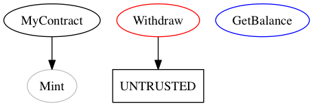
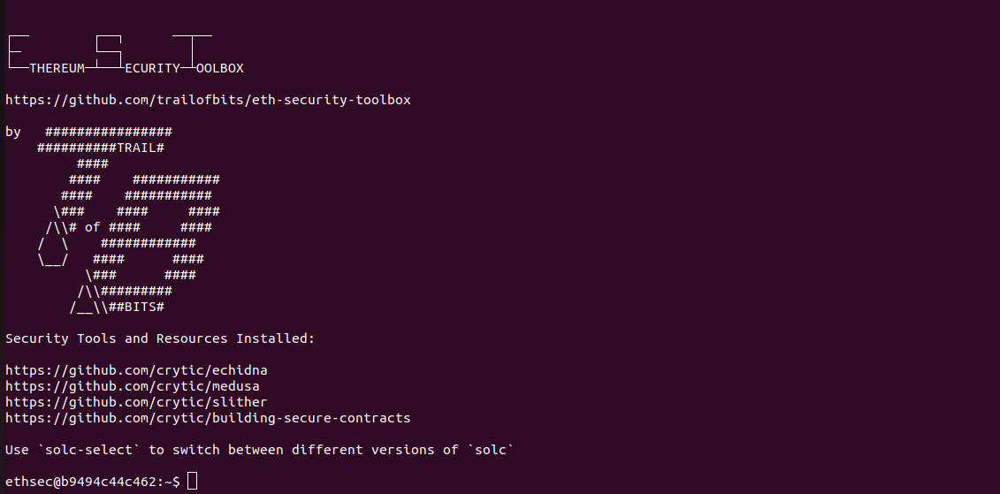

# Solidity Security Audit Report

## Prerequisites
  - Docker installation is required. For instructions, refer to [Docker Installation Guide](/Docker.md).
  - Pull the Solgraph Docker image using the following command:
    ```
    docker pull devopstestlab/solgraph
    ```

## Smart Contract Creation
1. Create the smart contract in Solidity:
    ```bash
    sudo mkdir data
    cd data
    sudo vi MyContracts.sol
    ```

2. Run the smart contract in the Solgraph Docker image:
    ```bash
    docker run -it --rm -v $PWD:/data devopstestlab/solgraph
    ```

3. View the generated image:
    ```
    xdg-open MyContracts.sol.png
    ```
    

## Solidity Smart Contracts Security Audit Images

**Slither:** Refer to the [official documentation](https://github.com/crytic/slither) for detailed usage.

## Using Slither
1. Pull the Eth Security Toolbox Docker image:
    ```bash
    docker pull trailofbits/eth-security-toolbox
    ```

2. Create a new Solidity smart contract (Voting Blockchain):
    ```solidity
    contract MyContract {
      uint balance;

      function MyContract() {
        Mint(1000000);
      }

      function Mint(uint amount) internal {
        balance = amount;
      }

      function Withdraw() {
        msg.sender.send(balance);
      }

      function GetBalance() constant returns(uint) {
        return balance;
      }
    }
    ```

3. Mount the contracts data directory to the container and run Slither:
    ```bash
    docker run -v $(pwd)/contracts:/contracts/ trailofbits/eth-security-toolbox bash -c "solc /contracts/mycontract.sol"
    ```
    

**Note:** One could directly open an interactive terminal using:
```bash
docker run -it -v $(pwd)/contracts:/contracts/ trailofbits/eth-security-toolbox bash
